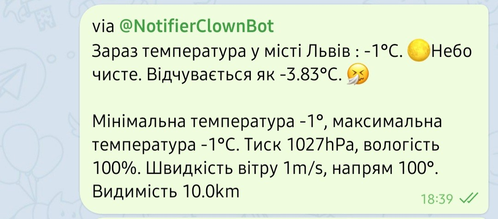
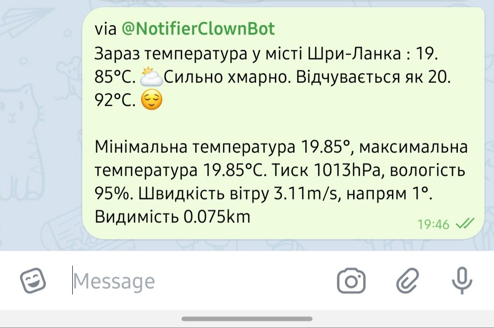
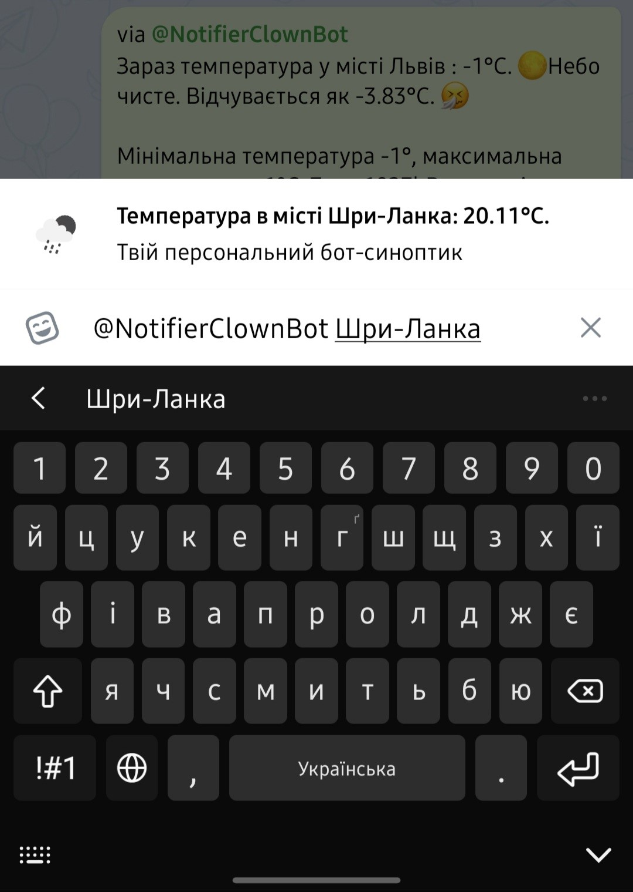

# TelegramWeatherBot

    Telegram Weather Bot on API

Bot takes information from the free api [openweathermap.org](https://openweathermap.org/api). Implemented the ability to use in personal chat and inline mode.

There is two command to use:
- First command gives a short answer in a personal chat
- Second command gives extended replies in a personal chat and is used inline mode

Command in personal chat look like this:

</img> 

</img> 

Command in another chat via inline-mode look like this:

